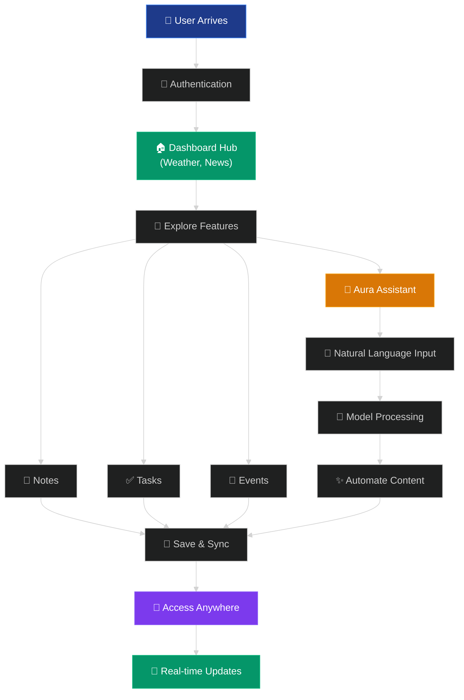

# AuraOne - A Digital Management Hub

**Sick of app overload?** AuraOne puts your tasks, notes, events, and news in one smart, AI-powered hub.**One app, zero chaos—just pure focus.**
An **intelligent personal assistant** designed for comprehensive task management, note-taking, event scheduling, and news aggregation.

## 🚀 Features

### ✨ Core Features
- **🔐 User Authentication** - Secure Firebase Authentication with email/password
- **💬 Aura Assistant** - AI Powered Functional Chat Based Assistant
- **📝 Note Management** - Rich text editor with tags and organization
- **✅ Task Management** - Priority-based task tracking with due dates
- **🎯 Task Prioritization** - Intelligent task recommendations
- **📅 Event Scheduling** - Interactive calendar with event management
- **📰 News Aggregation** - Real-time news from multiple sources
- **🌤️ Weather Integration** - Current weather and 5-day forecasts
- **🎨 Dark/Light Theme** - Seamless theme switching with system preference detection

### 🎨 User Experience
- **📱 Responsive Design** - Optimized for desktop, tablet, and mobile
- **⚡ Real-time Updates** - Live data synchronization across devices
- **🎭 Smooth Animations** - Framer Motion powered transitions
- **♿ Accessibility** - WCAG compliant with keyboard navigation

## 🔄 User Workflow



**Professional Workflow:**
1. **🔐 Secure Access** → Firebase authentication with email/password
2. **🏠 Centralized Hub** → Dashboard with weather, tasks, news, and calendar widgets
3. **🎯 Multi-Modal Input** → Traditional UI or AI-powered natural language
4. **🤖 Intelligent Processing** → AI parses requests and calls appropriate functions
5. **💾 Seamless Sync** → Real-time updates across all devices
6. **📱 Universal Access** → Responsive design for desktop, tablet, and mobile

## 🏗️ Architecture

### Tech Stack
- **Frontend**: React 18.3.1, TypeScript 5.5.3, Vite 5.4.2
- **Styling**: Tailwind CSS 3.4.1, Framer Motion 11.0.8
- **Backend**: Firebase (Authentication, Firestore)
- **AI**: Google Gemini API (Primary), Qwen-Coder (Ollama Fallback)
- **APIs**: OpenWeatherMap, NewsData.io
- **UI Components**: Radix UI, Lucide React Icons

### 🤖 AI Service Architecture
AuraOne features a unified AI service that intelligently manages both Gemini and Qwen models:

- **Primary Model**: Google Gemini 2.0 Flash for 24/7 reliability
- **Fallback Model**: Qwen 2.5 Coder (1.5B) via Ollama for local development
- **Automatic Fallback**: Seamless switching when primary model is unavailable
- **Schema Validation**: Strict Zod validation ensures consistent AI responses
- **Auto-Repair**: Invalid responses automatically retried with repair prompts
- **Environment-Aware**: Different configurations for development vs production
- **Unified Logic**: Same parsing, validation, and CRUD mapping for both models

### Project Structure
```
src/
├── components/          # Reusable UI components
│   ├── structure/      # Layout components (Sidebar, Layout)
│   ├── ui/            # Base UI components (Card, Loader)
│   ├── widgets/       # Dashboard widgets
│   ├── tasks/         # Task-specific components
│   └── notes/         # Note-specific components
├── pages/             # Route components
├── hooks/             # Custom React hooks (useAuth, useTasks, useNotes, useEvents)
├── services/          # External service integrations
│   ├── aiService.ts   # Unified AI service (Gemini + Qwen)
│   ├── chatHandler.ts # Chat orchestrator
│   ├── chatSessionService.ts # Chat session management
│   └── firebase.ts    # Firebase configuration
├── config/            # Configuration files (API keys, environment)
└── utils/             # Utility functions
    └── aiCommandSchema.ts # Zod validation schemas
```

## 🎯 Features in Detail

### Dashboard
- **Weather Widget**: Real-time weather with 5-day forecast
- **Tasks Widget**: Quick task overview with priority indicators
- **Calendar Widget**: Upcoming events and quick event creation
- **News Widget**: Latest news with source attribution

### Notes Management
- **Rich Text Editor**: TipTap-based editor with formatting support
- **Tagging & Organization**: Add, edit, and remove custom tags to organize notes efficiently
- **Search & Filter**: Instantly search notes by content or tag with full-text search and tag-based filtering
- **Note CRUD**: Create, update, and delete notes with real-time sync

### Task Management
- **Priority Levels**: High, Medium, Low priority classification
- **Due Date Tracking**: Calendar integration with overdue alerts
- **Status Management**: Complete/pending task states

### Calendar & Events
- **Interactive Calendar**: Month view with event indicators
- **Event Creation**: Quick add events with time and date
- **Event Management**: Edit and delete events
- **Today's Schedule**: Focused view of current day

## 🏷️ Releases

### v1.0 - Gemini LLM Integration
- Integrated Gemini 2.0 Flash for AI-powered task, event, and note creation via prompt.
- Enhanced with custom parsing commands.

### [v1.1 - Qwen LLM Integration](https://github.com/dhyan2815/AuraOne/releases/tag/v1.1-qwen)
- Added Qwen-Coder2.5 (1.5B parameters) for advanced prompt-based automation.
- Improved custom parsing capabilities.

### [v1.2 - Unified Models Integration](https://github.com/dhyan2815/AuraOne/releases/tag/v1.2-unified)
- Single service handling both Gemini and Qwen with automatic fallback
- Better natural language parsing for tasks, notes, and events
- Single `aiService.ts` handles all AI operations


## 👨‍💻 Author

**Dhyan Patel**
- GitHub: [@dhyan2815](https://github.com/dhyan2815)
- LinkedIn: [Dhyan Patel](https://linkedin.com/in/dhyan-patel)
- Portfolio: [Dhyan Dev](https://dhyan-patel.onrender.com)

## 🙏 Acknowledgments

- [React](https://reactjs.org/) for the amazing framework
- [Firebase](https://firebase.google.com/) for backend services
- [Tailwind CSS](https://tailwindcss.com/) for utility-first CSS
- [Vite](https://vitejs.dev/) for fast build tooling
- [Framer Motion](https://www.framer.com/motion/) for animations
- [OpenWeatherMap](https://openweathermap.org/) for weather data
- [NewsData.io](https://newsdata.io/) for news aggregation
- [Zod](https://zod.dev/) for robust schema validation

---

<div align="center">
  <p><strong>Empower your productivity with the only AuraOne</strong><br>Created by <a href="https://github.com/dhyan2815">Dhyan Patel</a></p>
  <p>
    <a href="https://aura-one1.web.app/">🌐 Live Demo</a> •
    <a href="https://github.com/dhyan2815/AuraOne/issues">🐛 Report Bug</a> •
    <a href="https://github.com/dhyan2815/AuraOne/issues">💡 Request Feature</a>
  </p>
</div>

