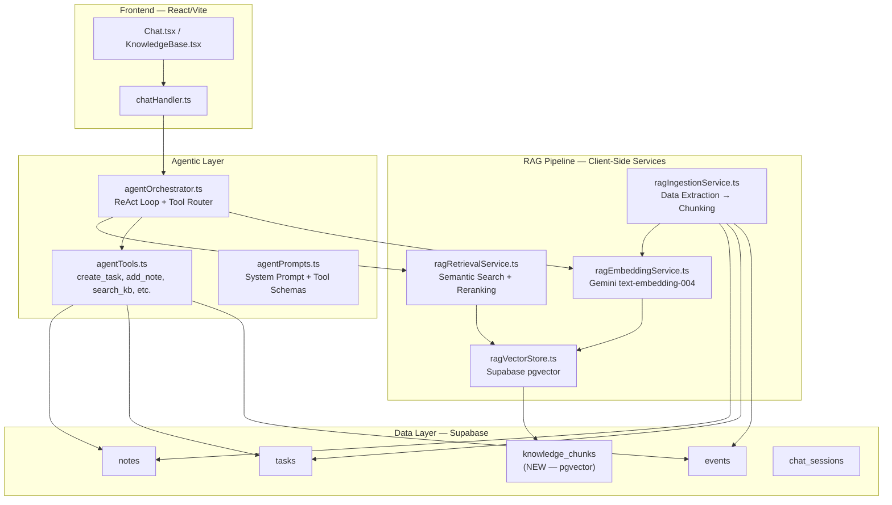
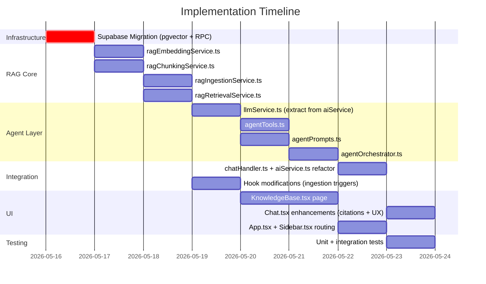

# Agentic RAG System — Implementation Plan for AuraOne

> Transform the Aura Assistant from a stateless prompt-to-JSON command router into a context-aware, tool-using **Agentic RAG** system that retrieves, reasons over, and acts upon the user's personal knowledge base (notes, tasks, events).

---

## Architecture Overview



---

## User Review Required

> [!IMPORTANT]
> **Supabase pgvector Extension**: This plan requires enabling the `vector` extension in your Supabase project (`Extensions → pgvector → Enable`). This is a free, one-click operation in the Supabase dashboard but must be done before running any migration SQL.

> [!IMPORTANT]
> **Embedding Model — Gemini `text-embedding-004`**: We'll use Google's free Gemini embedding API (`text-embedding-004`, 768 dimensions) since you already have `VITE_GEMINI_API_KEY`. No new API keys required. This model outputs 768-dimensional vectors with excellent quality for semantic search.

> [!WARNING]
> **Initial Ingestion Latency**: The first-time embedding pass for all existing notes, tasks, and events will make sequential Gemini API calls. For ~20-50 records, this takes ~10-15 seconds. A progress indicator will be shown. Subsequent changes are indexed incrementally via real-time Supabase triggers.

> [!IMPORTANT]
> **Knowledge Base Page**: A new `/knowledge` route will be added to the sidebar navigation. This page lets users view their indexed knowledge chunks, trigger re-indexing, see RAG retrieval stats, and manage their personal knowledge base. This is the **visible feature** the user interacts with.

---

## Open Questions

> [!IMPORTANT]
> **1. Action Confirmation UI**: The technical plan mentions "action confirmation" for sensitive operations (deleting a task, scheduling a major event). Should the agent present a confirmation card in the chat before executing, or should we skip this for v1 and auto-execute like today?

> [!IMPORTANT]
> **2. Knowledge Base Scope**: Should chat message history also be indexed into the knowledge base (so the agent remembers past conversations), or should we limit it to notes, tasks, and events only for v1?

> [!IMPORTANT]
> **3. Source Citations Display**: When the AI answers using retrieved context, should citations appear as inline links within the message, or as a collapsible "Sources" section below the response?

---

## Proposed Changes

### Phase 1: Vector Storage Infrastructure (Supabase)

#### [NEW] Supabase SQL Migration — `knowledge_chunks` table + pgvector index

Execute in **Supabase SQL Editor**:

```sql
-- Enable pgvector extension
CREATE EXTENSION IF NOT EXISTS vector;

-- Knowledge chunks table
CREATE TABLE knowledge_chunks (
  id UUID DEFAULT gen_random_uuid() PRIMARY KEY,
  user_id UUID NOT NULL REFERENCES auth.users(id) ON DELETE CASCADE,
  source_type TEXT NOT NULL CHECK (source_type IN ('note', 'task', 'event')),
  source_id UUID NOT NULL,
  chunk_index INTEGER NOT NULL DEFAULT 0,
  content TEXT NOT NULL,
  embedding vector(768),  -- Gemini text-embedding-004 outputs 768 dims
  metadata JSONB DEFAULT '{}',
  created_at TIMESTAMPTZ DEFAULT now(),
  updated_at TIMESTAMPTZ DEFAULT now(),
  
  UNIQUE(source_id, chunk_index)
);

-- HNSW index for fast approximate nearest neighbor search
CREATE INDEX knowledge_chunks_embedding_idx 
  ON knowledge_chunks 
  USING hnsw (embedding vector_cosine_ops)
  WITH (m = 16, ef_construction = 64);

-- Index for filtering by user
CREATE INDEX knowledge_chunks_user_id_idx ON knowledge_chunks(user_id);
CREATE INDEX knowledge_chunks_source_idx ON knowledge_chunks(source_type, source_id);

-- RLS policies
ALTER TABLE knowledge_chunks ENABLE ROW LEVEL SECURITY;

CREATE POLICY "Users can read own chunks" ON knowledge_chunks
  FOR SELECT USING (auth.uid() = user_id);

CREATE POLICY "Users can insert own chunks" ON knowledge_chunks
  FOR INSERT WITH CHECK (auth.uid() = user_id);

CREATE POLICY "Users can update own chunks" ON knowledge_chunks
  FOR UPDATE USING (auth.uid() = user_id);

CREATE POLICY "Users can delete own chunks" ON knowledge_chunks
  FOR DELETE USING (auth.uid() = user_id);

-- Semantic search function (called from client via supabase.rpc)
CREATE OR REPLACE FUNCTION match_knowledge_chunks(
  query_embedding vector(768),
  match_threshold FLOAT DEFAULT 0.5,
  match_count INT DEFAULT 10,
  filter_user_id UUID DEFAULT NULL
)
RETURNS TABLE (
  id UUID,
  source_type TEXT,
  source_id UUID,
  chunk_index INTEGER,
  content TEXT,
  metadata JSONB,
  similarity FLOAT
)
LANGUAGE plpgsql
AS $$
BEGIN
  RETURN QUERY
  SELECT
    kc.id,
    kc.source_type,
    kc.source_id,
    kc.chunk_index,
    kc.content,
    kc.metadata,
    1 - (kc.embedding <=> query_embedding) AS similarity
  FROM knowledge_chunks kc
  WHERE 
    kc.user_id = filter_user_id
    AND 1 - (kc.embedding <=> query_embedding) > match_threshold
  ORDER BY kc.embedding <=> query_embedding
  LIMIT match_count;
END;
$$;
```

---

### Phase 2: RAG Core Services

#### [NEW] [ragEmbeddingService.ts](file:///c:/Users/dhyan/Documents/DP%20Code's/Web%20Stack/TypeScripts/AuraOne/src/services/ragEmbeddingService.ts)

Handles calling the Gemini embedding API to convert text → 768-dim float vectors.

- Uses existing `VITE_GEMINI_API_KEY` from `api.ts`
- Endpoint: `https://generativelanguage.googleapis.com/v1beta/models/text-embedding-004:embedContent`
- Supports single text and batch embedding (up to 100 texts per request via `batchEmbedContents`)
- Implements retry logic with exponential backoff (reuses `SERVICE_CONFIG` pattern from `aiService.ts`)
- Exports: `embedText(text: string): Promise<number[]>`, `embedBatch(texts: string[]): Promise<number[][]>`

---

#### [NEW] [ragChunkingService.ts](file:///c:/Users/dhyan/Documents/DP%20Code's/Web%20Stack/TypeScripts/AuraOne/src/services/ragChunkingService.ts)

Text extraction, cleaning, and chunking logic.

- **Notes**: Strip HTML/Markdown tags → chunk by paragraph with 512-token limit and 50-token overlap
- **Tasks**: Each task = 1 chunk (title + description + due date + priority as structured text)
- **Events**: Each event = 1 chunk (title + description + start/end time as structured text)
- Exports: `chunkNote(note: Note): ChunkData[]`, `chunkTask(task: Task): ChunkData[]`, `chunkEvent(event: Event): ChunkData[]`
- `ChunkData` type: `{ content: string; sourceType: 'note' | 'task' | 'event'; sourceId: string; chunkIndex: number; metadata: Record<string, unknown> }`

---

#### [NEW] [ragIngestionService.ts](file:///c:/Users/dhyan/Documents/DP%20Code's/Web%20Stack/TypeScripts/AuraOne/src/services/ragIngestionService.ts)

Orchestrates the full ingestion pipeline: extract → chunk → embed → store.

- `ingestAllForUser(userId: string, onProgress?: (pct: number) => void)`: Full re-index of all user data
- `ingestItem(userId: string, sourceType, sourceId)`: Incremental index for a single item (used on create/update)
- `removeItem(sourceId: string)`: Delete chunks when source is deleted
- Internally calls `ragChunkingService` → `ragEmbeddingService` → Supabase `knowledge_chunks` upsert
- Deduplication via `UNIQUE(source_id, chunk_index)` constraint

---

#### [NEW] [ragRetrievalService.ts](file:///c:/Users/dhyan/Documents/DP%20Code's/Web%20Stack/TypeScripts/AuraOne/src/services/ragRetrievalService.ts)

Semantic search over the vector store.

- `retrieveContext(userId: string, query: string, topK?: number): Promise<RetrievalResult[]>`
- Workflow: embed query → call Supabase RPC `match_knowledge_chunks` → return ranked results with similarity scores
- `RetrievalResult` type: `{ content: string; sourceType: string; sourceId: string; similarity: number; metadata: Record<string, unknown> }`
- Optional: client-side reranking by combining semantic similarity with recency boost (newer items score slightly higher)

---

### Phase 3: Agentic Layer

#### [NEW] [agentTools.ts](file:///c:/Users/dhyan/Documents/DP%20Code's/Web%20Stack/TypeScripts/AuraOne/src/services/agentTools.ts)

Defines the tool interfaces the LLM can call via function-calling.

```typescript
// Tool definitions following OpenAI function-calling schema (Gemini-compatible)
export const AGENT_TOOLS = [
  {
    name: 'search_knowledge_base',
    description: 'Search the user\'s personal knowledge base (notes, tasks, events) for relevant information.',
    parameters: {
      type: 'object',
      properties: {
        query: { type: 'string', description: 'The semantic search query' },
        source_filter: { type: 'string', enum: ['note', 'task', 'event', 'all'], description: 'Filter by source type' }
      },
      required: ['query']
    }
  },
  {
    name: 'create_task',
    description: 'Create a new task in the user\'s workboard.',
    parameters: { /* title, description, dueDate, priority */ }
  },
  {
    name: 'create_note',
    description: 'Create a new note.',
    parameters: { /* title, content, tags */ }
  },
  {
    name: 'schedule_event',
    description: 'Schedule a new calendar event.',
    parameters: { /* title, date, time, description */ }
  },
  {
    name: 'update_task_status',
    description: 'Mark a task as completed or update its priority.',
    parameters: { /* task_id, completed, priority */ }
  },
  {
    name: 'list_items',
    description: 'List tasks, notes, or events with optional filters.',
    parameters: { /* type, filter */ }
  }
];
```

Each tool has a corresponding `executeTool(name, params, userId)` function that calls existing CRUD functions from `useNotes.ts`, `useTasks.ts`, `useEvents.ts`.

---

#### [NEW] [agentOrchestrator.ts](file:///c:/Users/dhyan/Documents/DP%20Code's/Web%20Stack/TypeScripts/AuraOne/src/services/agentOrchestrator.ts)

The **ReAct (Reason + Act) loop** — the brain of the agentic system.

```
User Query
    ↓
[1] Embed query → Retrieve top-K context from knowledge_chunks
    ↓
[2] Build augmented prompt: System Prompt + Retrieved Context + Tool Definitions + User Query
    ↓
[3] Call Gemini with function_calling enabled
    ↓
[4] LLM returns either:
    ├─ (a) Direct text response → Return to user with source citations
    └─ (b) Function call → Execute tool → Feed result back to LLM → Repeat from [3]
    ↓
[5] Max 5 iterations (prevent infinite loops)
    ↓
[6] Return final response + source citations to chatHandler
```

- Uses Gemini's native `function_calling` mode (`tool_config: { function_calling_config: { mode: "AUTO" } }`)
- Falls back to OpenRouter if Gemini fails (preserving existing resilience pattern)
- Emits structured response: `{ message: string; sources: SourceCitation[]; toolsUsed: string[] }`

---

#### [NEW] [agentPrompts.ts](file:///c:/Users/dhyan/Documents/DP%20Code's/Web%20Stack/TypeScripts/AuraOne/src/services/agentPrompts.ts)

Centralized prompt management for the agentic system.

- `AGENT_SYSTEM_PROMPT`: Defines Aura's role, reasoning instructions, context usage guidelines, and output formatting rules
- `buildAugmentedPrompt(context: RetrievalResult[], userQuery: string)`: Constructs the full prompt with retrieved context injected as `[CONTEXT]` blocks
- `TOOL_USAGE_INSTRUCTIONS`: Guidelines for when to use tools vs. answer directly

---

### Phase 4: Integration with Existing Systems

#### [MODIFY] [chatHandler.ts](file:///c:/Users/dhyan/Documents/DP%20Code's/Web%20Stack/TypeScripts/AuraOne/src/services/chatHandler.ts)

- Replace `processAIRequest()` call with `agentOrchestrator.processAgenticRequest()` for the primary flow
- Preserve `isBrainMode` toggle — Brain Mode now uses deep reasoning with RAG context (OpenRouter + retrieved context)
- Add `sources` field to AI response messages (stored as `metadata` JSONB in `chat_messages`)

#### [MODIFY] [aiService.ts](file:///c:/Users/dhyan/Documents/DP%20Code's/Web%20Stack/TypeScripts/AuraOne/src/services/aiService.ts)

- Extract `callGeminiAPI` and `callOpenRouterAPI` into a shared `llmService.ts` used by both the legacy path and the new agent orchestrator
- Add new `callGeminiWithTools(prompt, tools, toolConfig)` function that supports Gemini's function-calling API
- Keep existing `processAIRequest` as a fallback but mark as `@deprecated`

#### [MODIFY] [api.ts](file:///c:/Users/dhyan/Documents/DP%20Code's/Web%20Stack/TypeScripts/AuraOne/src/config/api.ts)

- Add `GEMINI_EMBEDDING_MODEL: "text-embedding-004"` to `API_CONFIG`
- Add `getRAGConfig()` helper exporting embedding model, vector dimensions, and search thresholds

---

### Phase 5: Incremental Indexing (Real-Time Sync)

#### [MODIFY] [useNotes.ts](file:///c:/Users/dhyan/Documents/DP%20Code's/Web%20Stack/TypeScripts/AuraOne/src/hooks/useNotes.ts)

- After `createNote()` → call `ragIngestionService.ingestItem(userId, 'note', newNote.id)`
- After `updateNote()` → call `ragIngestionService.ingestItem(userId, 'note', noteId)`
- After `deleteNote()` → call `ragIngestionService.removeItem(noteId)`

#### [MODIFY] [useTasks.ts](file:///c:/Users/dhyan/Documents/DP%20Code's/Web%20Stack/TypeScripts/AuraOne/src/hooks/useTasks.ts)

- Same pattern: ingest on create/update, remove on delete

#### [MODIFY] [useEvents.ts](file:///c:/Users/dhyan/Documents/DP%20Code's/Web%20Stack/TypeScripts/AuraOne/src/hooks/useEvents.ts)

- Same pattern: ingest on create/update, remove on delete

---

### Phase 6: Knowledge Base Page (New UI)

#### [NEW] [KnowledgeBase.tsx](file:///c:/Users/dhyan/Documents/DP%20Code's/Web%20Stack/TypeScripts/AuraOne/src/pages/KnowledgeBase.tsx)

A full-page Knowledge Base management interface:

- **Stats Dashboard**: Total indexed chunks, breakdown by source type (notes/tasks/events), last sync timestamp
- **Knowledge Explorer**: Searchable list of all indexed chunks with source previews
- **Sync Controls**: "Rebuild Index" button with progress bar, per-source-type toggle
- **Search Playground**: Test semantic search queries and see retrieved results with similarity scores
- **Design**: Follows Aurora Glass aesthetic — `.glass` containers, `primary/secondary` gradients, `framer-motion` animations

#### [MODIFY] [App.tsx](file:///c:/Users/dhyan/Documents/DP%20Code's/Web%20Stack/TypeScripts/AuraOne/src/App.tsx)

- Add route: `<Route path="knowledge" element={<KnowledgeBase />} />`

#### [MODIFY] [Sidebar.tsx](file:///c:/Users/dhyan/Documents/DP%20Code's/Web%20Stack/TypeScripts/AuraOne/src/components/structure/Sidebar.tsx)

- Add "Knowledge" nav item with `Brain` icon from `lucide-react` between "Chat" and bottom section

---

### Phase 7: Chat UI Enhancements

#### [MODIFY] [Chat.tsx](file:///c:/Users/dhyan/Documents/DP%20Code's/Web%20Stack/TypeScripts/AuraOne/src/pages/Chat.tsx)

- **Source Citations**: When AI response includes `sources`, render a collapsible "📚 Sources" section below the message with clickable links to the original note/task/event
- **Tool Usage Indicators**: Show real-time "🔍 Searching knowledge base...", "📝 Creating task...", etc. during agentic processing
- **Updated Thinking Steps**: Replace `HANDSHAKE_STEPS` with context-aware steps: "Searching your knowledge base...", "Reasoning over 4 relevant documents...", "Executing action..."

---

### Phase 8: Evaluation & Feedback

#### [MODIFY] [Chat.tsx](file:///c:/Users/dhyan/Documents/DP%20Code's/Web%20Stack/TypeScripts/AuraOne/src/pages/Chat.tsx)

- Add thumbs-up/thumbs-down buttons on each AI response message
- Store feedback in a `rag_feedback` table (or as metadata on `chat_messages`)

---

## New File Manifest

| File | Purpose | Size Estimate |
|------|---------|---------------|
| `src/services/ragEmbeddingService.ts` | Gemini embedding API client | ~120 lines |
| `src/services/ragChunkingService.ts` | Text extraction & chunking | ~150 lines |
| `src/services/ragIngestionService.ts` | Full ingestion pipeline | ~180 lines |
| `src/services/ragRetrievalService.ts` | Semantic search & retrieval | ~100 lines |
| `src/services/agentTools.ts` | Tool definitions & executors | ~200 lines |
| `src/services/agentOrchestrator.ts` | ReAct agentic loop | ~250 lines |
| `src/services/agentPrompts.ts` | Prompt templates | ~100 lines |
| `src/services/llmService.ts` | Shared LLM API layer | ~120 lines |
| `src/pages/KnowledgeBase.tsx` | Knowledge Base page | ~400 lines |

---

## Modified File Summary

| File | Changes |
|------|---------|
| `src/services/chatHandler.ts` | Route to agent orchestrator, source citations |
| `src/services/aiService.ts` | Extract LLM calls, add function-calling support |
| `src/config/api.ts` | Add embedding model config |
| `src/hooks/useNotes.ts` | Add RAG ingestion hooks |
| `src/hooks/useTasks.ts` | Add RAG ingestion hooks |
| `src/hooks/useEvents.ts` | Add RAG ingestion hooks |
| `src/App.tsx` | Add `/knowledge` route |
| `src/components/structure/Sidebar.tsx` | Add "Knowledge" nav item |
| `src/pages/Chat.tsx` | Source citations, tool indicators, feedback |

---

## Dependency Changes

```json
// No new npm dependencies required!
// - Embeddings: Gemini API (already configured via VITE_GEMINI_API_KEY)
// - Vector store: Supabase pgvector (server-side extension, no client package needed)
// - All vector operations go through supabase.rpc() calls
```

> [!TIP]
> This is a **zero-dependency** RAG implementation. We leverage Gemini's embedding API (already configured) and Supabase's pgvector extension (free, built-in). No ChromaDB, no Pinecone, no additional packages.

---

## Verification Plan

### Automated Tests
1. **Unit Tests**: `ragChunkingService` — verify chunking produces correct output for notes, tasks, events
2. **Unit Tests**: `ragEmbeddingService` — mock Gemini API, verify retry/backoff logic
3. **Integration Test**: Full pipeline — create note → verify chunk appears in `knowledge_chunks` → semantic search returns it
4. **Agent Test**: Send "What tasks are due this week?" → verify agent calls `search_knowledge_base` tool → returns relevant tasks with citations

### Manual Verification
1. **Knowledge Base Page**: Navigate to `/knowledge` → verify stats display, search playground works
2. **Chat RAG Flow**: Create a note about "Q3 revenue strategy" → Ask chat "What's our revenue plan?" → Verify it retrieves and cites the note
3. **Incremental Sync**: Create a new task → Check `/knowledge` stats update → Search for it immediately
4. **Source Citations**: Verify clickable source links navigate to the correct note/task/event page
5. **Browser Build**: Run `npm run build` to verify TypeScript compilation succeeds

---

## Execution Order


